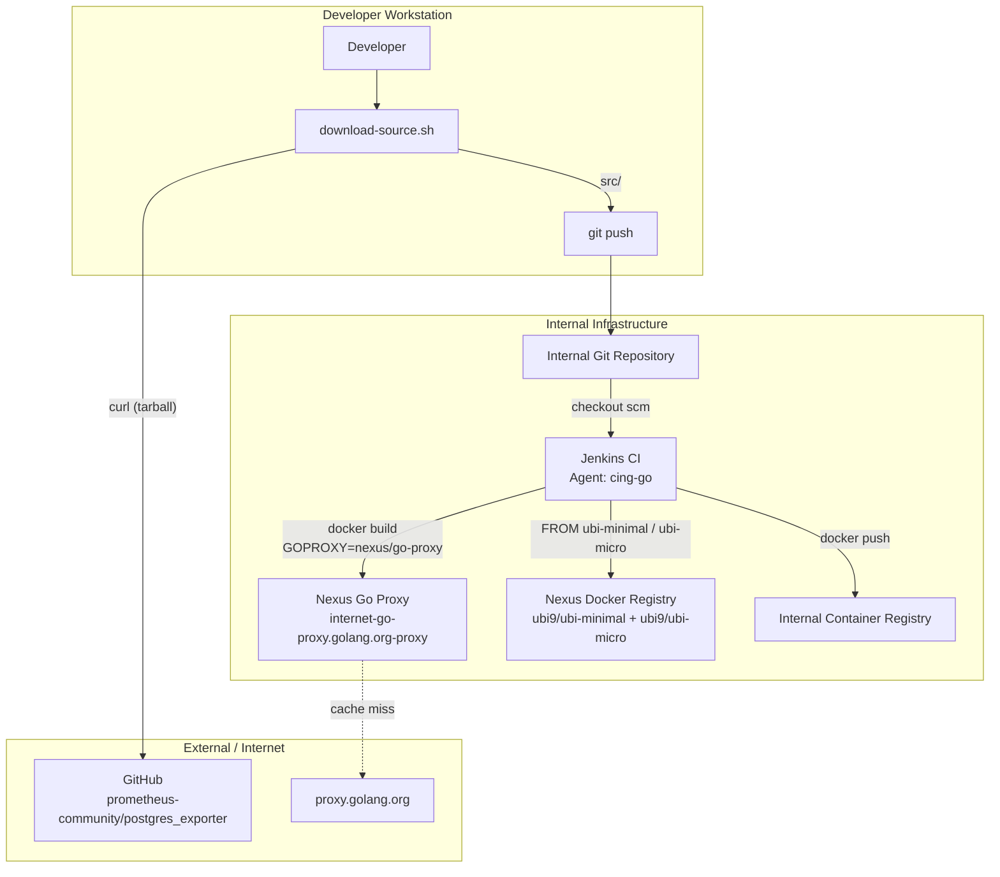
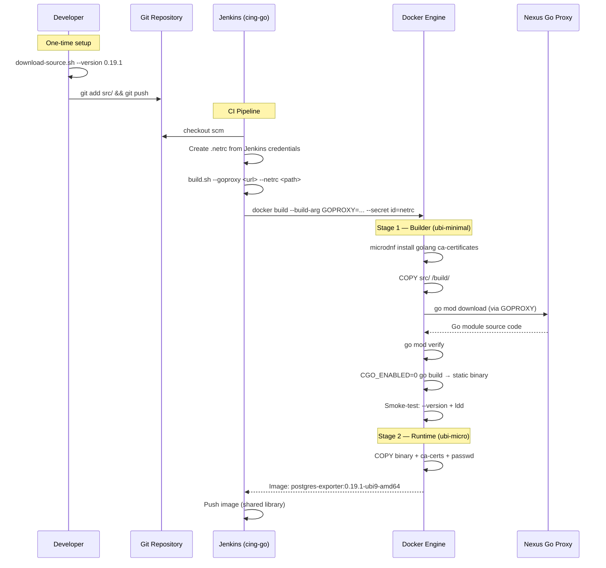
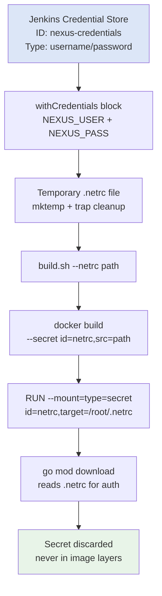

# GoProxy Build — Architecture and Technical Documentation

## Overview

The GoProxy build mode produces a postgres_exporter container image by downloading Go dependencies at build time through an internal Go module proxy (e.g. Nexus). It uses a Docker multi-stage build: a builder stage compiles the binary, and a runtime stage packages it into a minimal image.

## Architecture

### System Context



### Build Pipeline



### Docker Multi-Stage Build

```mermaid
graph LR
    subgraph "Stage 1 — Builder (ubi-minimal)"
        A1[microdnf install<br/>golang + ca-certificates]
        A2[COPY src/ /build/]
        A3["go mod download<br/>(via GOPROXY → Nexus)"]
        A4["go build<br/>CGO_ENABLED=0<br/>-trimpath -ldflags='-s -w ...'"]
        A5[Smoke-test<br/>--version + ldd]
        A6[Create /etc/passwd<br/>/etc/group entries]

        A1 --> A2 --> A3 --> A4 --> A5 --> A6
    end

    subgraph "Stage 2 — Runtime (ubi-micro, ~38 MB)"
        B1[COPY ca-bundle.crt]
        B2[COPY passwd + group]
        B3[COPY postgres_exporter]
        B4[USER 65534:0]
        B5["ENTRYPOINT<br/>[postgres_exporter]"]

        B1 --> B2 --> B3 --> B4 --> B5
    end

    A6 -- "Only 3 artifacts<br/>cross boundary" --> B1

    style A1 fill:#e8f4e8
    style A4 fill:#e8f4e8
    style B3 fill:#fff3cd
    style B5 fill:#fff3cd
```



### Credential Flow



## Component Details

### Dockerfile

The Dockerfile implements a two-stage build that produces a minimal runtime image.

#### Stage 1 — Builder

| Step | Command | Purpose |
|------|---------|---------|
| Install toolchain | `microdnf install -y golang ca-certificates` | Go compiler from UBI9 AppStream + TLS trust anchors |
| Copy source | `COPY src/ /build/` | Source code from git (no vendor directory) |
| Download deps | `go mod download` with `GOPROXY` build-arg | Fetch modules from internal Nexus proxy |
| Verify deps | `go mod verify` | Check module checksums match `go.sum` |
| Compile | `CGO_ENABLED=0 go build -trimpath -ldflags="..."` | Static binary, no libc dependency |
| Smoke-test | `--version` + `ldd` check | Verify binary runs and is statically linked |
| Create user | Append to `/etc/passwd` + `/etc/group` | Unprivileged runtime identity (UID 65534) |

**Key build flags:**

| Flag | Effect |
|------|--------|
| `CGO_ENABLED=0` | Pure Go, no C dependencies — binary runs on ubi-micro without libc |
| `-trimpath` | Strip build-host filesystem paths from binary |
| `-s` (ldflags) | Strip symbol table — reduces binary size |
| `-w` (ldflags) | Strip DWARF debug info — reduces binary size |
| `-X` (ldflags) | Inject version/revision/date strings at compile time |

**BuildKit secret mount:**

```dockerfile
RUN --mount=type=secret,id=netrc,target=/root/.netrc \
    GOPROXY="${GOPROXY}" go mod download
```

The `.netrc` file is mounted into the build container only for the duration of this `RUN` instruction. It is:
- Not copied into any image layer
- Not accessible in subsequent `RUN` instructions
- Not present in the final image
- Requires `DOCKER_BUILDKIT=1` (set by `build.sh`)

#### Stage 2 — Runtime

| Artifact | Source | Purpose |
|----------|--------|---------|
| `/etc/ssl/certs/ca-bundle.crt` | Builder | TLS certificates for PostgreSQL and HTTPS connections |
| `/etc/passwd` + `/etc/group` | Builder | Named identity entry for UID 65534 |
| `/usr/local/bin/postgres_exporter` | Builder | Static binary (chmod 0755) |

The runtime image (`ubi-micro`) is distroless-style: no shell, no package manager, no compilers. Only the three artifacts above are present.

**Runtime configuration:**

| Setting | Value | Reason |
|---------|-------|--------|
| `USER 65534:0` | UID 65534, GID 0 | Non-root. GID 0 follows OpenShift arbitrary-UID pattern |
| `EXPOSE 9187` | Metrics port | Prometheus scrape target |
| `ENTRYPOINT` exec form | `["/usr/local/bin/postgres_exporter"]` | No shell required (ubi-micro has none) |

### build.sh

Wrapper script that constructs and executes the `docker build` command with all required build-args and secrets.

**Execution flow:**

```
1. Parse arguments (--goproxy, --netrc, --version, etc.)
2. Detect container runtime (docker or podman)
3. Pre-flight checks:
   - Container runtime available?
   - --goproxy provided?
   - Dockerfile exists?
   - src/go.mod exists?
   - --netrc file exists (if provided)?
4. Derive metadata (BUILD_DATE, VCS_REF from git)
5. Construct docker build command:
   - --build-arg for GOPROXY, version, arch, images, etc.
   - --secret for .netrc (if provided)
   - DOCKER_BUILDKIT=1 to enable BuildKit
6. Execute build
7. Optional: Trivy CVE scan (--scan)
8. Optional: Push to registry (--push)
```

### Jenkinsfile

Declarative Jenkins pipeline with three stages.

**Stage: Checkout**
- `checkout scm` — source code (`src/`) is already committed to the repository

**Stage: Build Image**
- `withCredentials` fetches Nexus username/password from Jenkins credential store
- Creates temporary `.netrc` file with `mktemp`
- `trap` ensures cleanup on exit (success or failure)
- Calls `build.sh` which runs `docker build` with GOPROXY and BuildKit secret

**Stage: Push Image**
- Placeholder for shared library integration

### Build-args Reference

| Arg | Default | Required | Description |
|-----|---------|----------|-------------|
| `GOPROXY` | — | Yes | Internal Go proxy URL (e.g. `https://nexus.internal/repository/go-proxy/`) |
| `UBI_MINIMAL_IMAGE` | `registry.access.redhat.com/ubi9/ubi-minimal:latest` | No | Builder stage base image |
| `UBI_MICRO_IMAGE` | `registry.access.redhat.com/ubi9/ubi-micro:latest` | No | Runtime stage base image |
| `POSTGRES_EXPORTER_VERSION` | `0.19.1` | No | Version string embedded in binary |
| `TARGETOS` | `linux` | No | Target OS |
| `TARGETARCH` | `amd64` | No | Target architecture (`amd64` or `arm64`) |
| `VCS_REF` | `unknown` | No | Git commit SHA |
| `BUILD_DATE` | auto | No | ISO 8601 build timestamp |

## Security Considerations

| Aspect | Mechanism |
|--------|-----------|
| Non-root runtime | `USER 65534:0` — compatible with OpenShift `restricted-v2` SCC |
| Minimal attack surface | Runtime image has no shell, package manager, or compilers |
| Credential protection | `.netrc` mounted as BuildKit secret — never in image layers |
| Static binary | No shared libraries — zero runtime linker attack surface |
| Dependency verification | `go mod verify` checks all modules against `go.sum` checksums |
| Image labels | OCI-standard labels for traceability (version, revision, build date) |

## Network Requirements

| Connection | When | Purpose |
|------------|------|---------|
| Developer → GitHub | `download-source.sh` | Download upstream source tarball |
| Docker → Nexus Go Proxy | `go mod download` (during `docker build`) | Fetch Go module dependencies |
| Docker → Nexus Docker Registry | `FROM` instructions | Pull base images (ubi-minimal, ubi-micro) |
| CI → Internal Container Registry | Push stage | Publish final image |

The Nexus Go Proxy caches modules from `proxy.golang.org`. After the first build, subsequent builds use cached modules and do not require external internet access from Nexus.
