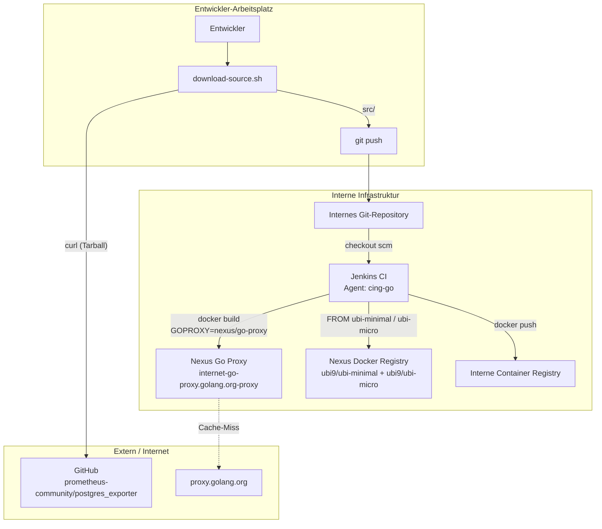
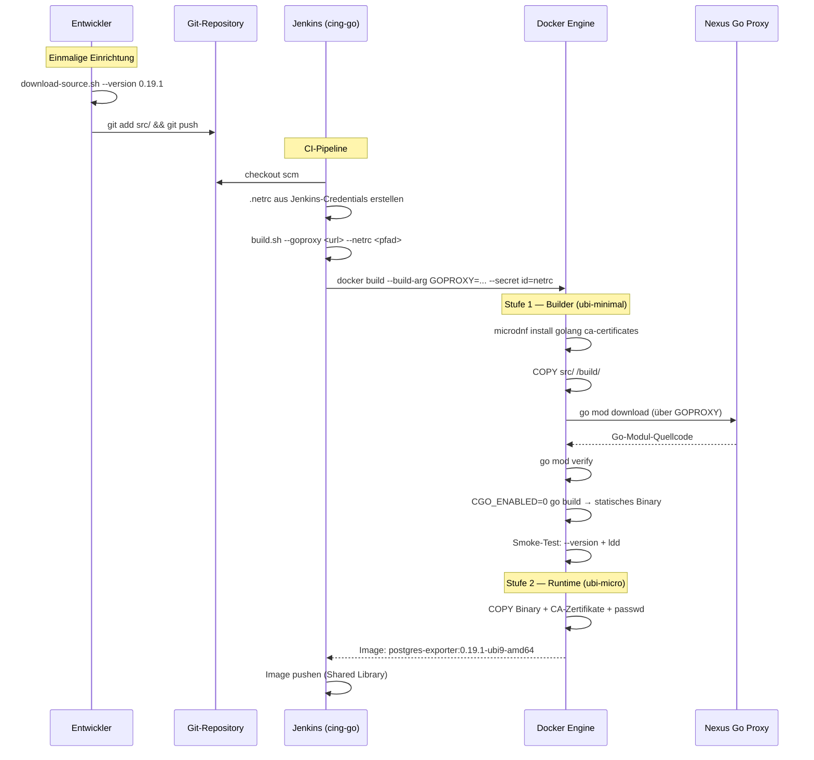
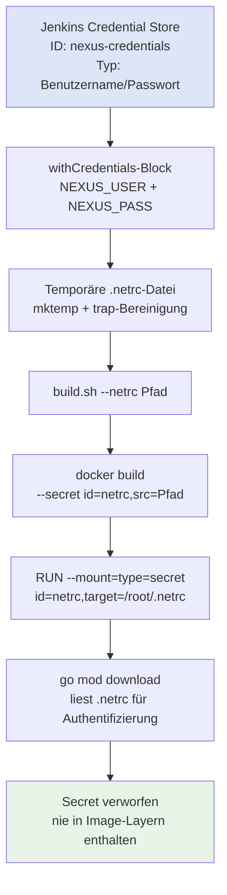

# GoProxy Build — Architektur und technische Dokumentation

## Überblick

Der GoProxy-Build-Modus erzeugt ein postgres_exporter-Container-Image, indem Go-Abhängigkeiten zur Build-Zeit über einen internen Go-Modul-Proxy (z. B. Nexus) heruntergeladen werden. Es wird ein Docker-Multi-Stage-Build verwendet: Eine Builder-Stufe kompiliert das Binary, eine Runtime-Stufe verpackt es in ein minimales Image.

## Architektur

### Systemkontext



### Build-Pipeline



### Docker Multi-Stage-Build

```mermaid
graph LR
    subgraph "Stufe 1 — Builder (ubi-minimal)"
        A1[microdnf install<br/>golang + ca-certificates]
        A2[COPY src/ /build/]
        A3["go mod download<br/>(über GOPROXY → Nexus)"]
        A4["go build<br/>CGO_ENABLED=0<br/>-trimpath -ldflags='-s -w ...'"]
        A5[Smoke-Test<br/>--version + ldd]
        A6[Erstelle /etc/passwd<br/>/etc/group Einträge]

        A1 --> A2 --> A3 --> A4 --> A5 --> A6
    end

    subgraph "Stufe 2 — Runtime (ubi-micro, ~38 MB)"
        B1[COPY ca-bundle.crt]
        B2[COPY passwd + group]
        B3[COPY postgres_exporter]
        B4[USER 65534:0]
        B5["ENTRYPOINT<br/>[postgres_exporter]"]

        B1 --> B2 --> B3 --> B4 --> B5
    end

    A6 -- "Nur 3 Artefakte<br/>überschreiten die Grenze" --> B1

    style A1 fill:#e8f4e8
    style A4 fill:#e8f4e8
    style B3 fill:#fff3cd
    style B5 fill:#fff3cd
```



### Credential-Fluss



## Komponentendetails

### Dockerfile

Das Dockerfile implementiert einen zweistufigen Build, der ein minimales Runtime-Image erzeugt.

#### Stufe 1 — Builder

| Schritt | Befehl | Zweck |
|---------|--------|-------|
| Toolchain installieren | `microdnf install -y golang ca-certificates` | Go-Compiler aus UBI9 AppStream + TLS-Vertrauensanker |
| Quellcode kopieren | `COPY src/ /build/` | Quellcode aus Git (kein Vendor-Verzeichnis) |
| Abhängigkeiten laden | `go mod download` mit `GOPROXY`-Build-Arg | Module vom internen Nexus-Proxy abrufen |
| Abhängigkeiten prüfen | `go mod verify` | Prüfsummen der Module gegen `go.sum` verifizieren |
| Kompilieren | `CGO_ENABLED=0 go build -trimpath -ldflags="..."` | Statisches Binary ohne libc-Abhängigkeit |
| Smoke-Test | `--version` + `ldd`-Prüfung | Binary-Ausführung und statische Verlinkung verifizieren |
| Benutzer erstellen | Einträge in `/etc/passwd` + `/etc/group` | Unprivilegierte Runtime-Identität (UID 65534) |

**Wichtige Build-Flags:**

| Flag | Wirkung |
|------|---------|
| `CGO_ENABLED=0` | Reines Go, keine C-Abhängigkeiten — Binary läuft auf ubi-micro ohne libc |
| `-trimpath` | Dateisystempfade des Build-Hosts aus dem Binary entfernen |
| `-s` (ldflags) | Symboltabelle entfernen — reduziert die Binary-Größe |
| `-w` (ldflags) | DWARF-Debug-Informationen entfernen — reduziert die Binary-Größe |
| `-X` (ldflags) | Versions-/Revisions-/Datums-Strings zur Kompilierzeit injizieren |

**BuildKit-Secret-Mount:**

```dockerfile
RUN --mount=type=secret,id=netrc,target=/root/.netrc \
    GOPROXY="${GOPROXY}" go mod download
```

Die `.netrc`-Datei wird nur für die Dauer dieser `RUN`-Anweisung in den Build-Container eingehängt. Sie wird:
- Nicht in einen Image-Layer kopiert
- Ist in nachfolgenden `RUN`-Anweisungen nicht zugänglich
- Ist im finalen Image nicht vorhanden
- Erfordert `DOCKER_BUILDKIT=1` (wird von `build.sh` gesetzt)

#### Stufe 2 — Runtime

| Artefakt | Quelle | Zweck |
|----------|--------|-------|
| `/etc/ssl/certs/ca-bundle.crt` | Builder | TLS-Zertifikate für PostgreSQL- und HTTPS-Verbindungen |
| `/etc/passwd` + `/etc/group` | Builder | Benannter Identitätseintrag für UID 65534 |
| `/usr/local/bin/postgres_exporter` | Builder | Statisches Binary (chmod 0755) |

Das Runtime-Image (`ubi-micro`) ist im Distroless-Stil aufgebaut: keine Shell, kein Paketmanager, keine Compiler. Nur die drei oben genannten Artefakte sind vorhanden.

**Runtime-Konfiguration:**

| Einstellung | Wert | Begründung |
|-------------|------|------------|
| `USER 65534:0` | UID 65534, GID 0 | Nicht-Root. GID 0 folgt dem OpenShift Arbitrary-UID-Muster |
| `EXPOSE 9187` | Metrics-Port | Prometheus-Scrape-Ziel |
| `ENTRYPOINT` Exec-Form | `["/usr/local/bin/postgres_exporter"]` | Keine Shell erforderlich (ubi-micro hat keine) |

### build.sh

Wrapper-Skript, das den `docker build`-Befehl mit allen erforderlichen Build-Args und Secrets zusammenstellt und ausführt.

**Ausführungsablauf:**

```
1. Argumente parsen (--goproxy, --netrc, --version, etc.)
2. Container-Runtime erkennen (docker oder podman)
3. Vorabprüfungen:
   - Container-Runtime verfügbar?
   - --goproxy angegeben?
   - Dockerfile vorhanden?
   - src/go.mod vorhanden?
   - --netrc-Datei vorhanden (falls angegeben)?
4. Metadaten ableiten (BUILD_DATE, VCS_REF aus Git)
5. docker build-Befehl zusammenstellen:
   - --build-arg für GOPROXY, Version, Architektur, Images, etc.
   - --secret für .netrc (falls angegeben)
   - DOCKER_BUILDKIT=1 zur Aktivierung von BuildKit
6. Build ausführen
7. Optional: Trivy-CVE-Scan (--scan)
8. Optional: In Registry pushen (--push)
```

### Jenkinsfile

Deklarative Jenkins-Pipeline mit drei Stufen.

**Stufe: Checkout**
- `checkout scm` — Quellcode (`src/`) ist bereits im Repository committet

**Stufe: Build Image**
- `withCredentials` ruft Nexus-Benutzername/-Passwort aus dem Jenkins Credential Store ab
- Erstellt temporäre `.netrc`-Datei mit `mktemp`
- `trap` stellt die Bereinigung bei Beendigung sicher (Erfolg oder Fehler)
- Ruft `build.sh` auf, das `docker build` mit GOPROXY und BuildKit-Secret ausführt

**Stufe: Push Image**
- Platzhalter für die Integration der Shared Library

### Build-Args-Referenz

| Arg | Standard | Erforderlich | Beschreibung |
|-----|----------|--------------|--------------|
| `GOPROXY` | — | Ja | Interne Go-Proxy-URL (z. B. `https://nexus.internal/repository/go-proxy/`) |
| `UBI_MINIMAL_IMAGE` | `registry.access.redhat.com/ubi9/ubi-minimal:latest` | Nein | Basis-Image der Builder-Stufe |
| `UBI_MICRO_IMAGE` | `registry.access.redhat.com/ubi9/ubi-micro:latest` | Nein | Basis-Image der Runtime-Stufe |
| `POSTGRES_EXPORTER_VERSION` | `0.19.1` | Nein | In das Binary eingebetteter Versions-String |
| `TARGETOS` | `linux` | Nein | Ziel-Betriebssystem |
| `TARGETARCH` | `amd64` | Nein | Ziel-Architektur (`amd64` oder `arm64`) |
| `VCS_REF` | `unknown` | Nein | Git-Commit-SHA |
| `BUILD_DATE` | automatisch | Nein | ISO 8601 Build-Zeitstempel |

## Sicherheitsaspekte

| Aspekt | Mechanismus |
|--------|-------------|
| Nicht-Root-Runtime | `USER 65534:0` — kompatibel mit OpenShift `restricted-v2` SCC |
| Minimale Angriffsfläche | Runtime-Image hat keine Shell, keinen Paketmanager und keine Compiler |
| Schutz der Zugangsdaten | `.netrc` als BuildKit-Secret eingehängt — nie in Image-Layern enthalten |
| Statisches Binary | Keine Shared Libraries — keine Angriffsfläche durch den Runtime-Linker |
| Abhängigkeitsverifikation | `go mod verify` prüft alle Module gegen `go.sum`-Prüfsummen |
| Image-Labels | OCI-Standard-Labels für Nachverfolgbarkeit (Version, Revision, Build-Datum) |

## Netzwerkanforderungen

| Verbindung | Zeitpunkt | Zweck |
|------------|-----------|-------|
| Entwickler → GitHub | `download-source.sh` | Upstream-Quellcode-Tarball herunterladen |
| Docker → Nexus Go Proxy | `go mod download` (während `docker build`) | Go-Modul-Abhängigkeiten abrufen |
| Docker → Nexus Docker Registry | `FROM`-Anweisungen | Basis-Images (ubi-minimal, ubi-micro) laden |
| CI → Interne Container Registry | Push-Stufe | Finales Image veröffentlichen |

Der Nexus Go Proxy speichert Module von `proxy.golang.org` im Cache. Nach dem ersten Build verwenden nachfolgende Builds die gecachten Module und benötigen keinen externen Internetzugang von Nexus.
